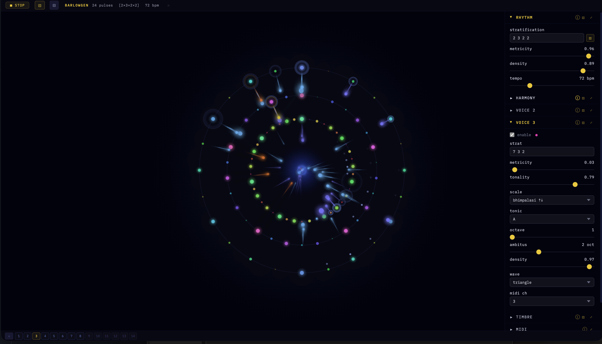

# Barlowgen

**A living algorithmic instrument built on Clarence Barlow's mathematics of rhythm and harmony.**

> *"The degree to which a note is felt to belong to the metric structure of a piece."*
> — Clarence Barlow, on indispensability

---

## What it is

Barlowgen is a single-file browser instrument. No installation, no build step, no server. Open `barlowgen.html` in Chrome or Edge and it runs.

It implements three of Barlow's foundational theories as real-time, interactive controls:

**Indigestibility** measures the arithmetic complexity of a number. Prime 2 is simple (indigestibility ≈ 0.5), prime 7 is complex (≈ 8.2), composite 12 falls between its factors. The formula: `ξ(N) = Σ e · 2(p−1)²/p` across all prime factors p with exponent e.

**Harmonicity** measures the consonance of an interval P:Q as the reciprocal of the sum of indigestibilities of numerator and denominator. A perfect fifth (3:2) is highly harmonic; a tritone (45:32) is not. Barlowgen uses harmonicity to weight pitch selection in real time — the Tonality slider controls how strongly harmonic intervals are favored.

**Indispensability** ranks every pulse position within a metric structure by how essential it is to the perception of that meter. In 4/4, beat 1 scores highest, beat 3 next, beats 2 and 4 lower, and the subdivisions lowest of all. Barlowgen uses these ranks to shape note probability, velocity, duration, and legato — strong beats are louder, longer, more likely to sound; weak beats are shorter, quieter, passing.

The result is generative music that breathes with mathematical intentionality rather than uniform randomness.

---

## How to run

1. Clone or download this repository
2. Open `barlowgen.html` in **Chrome** or **Edge** (required for WebMIDI and WebAudio)
3. Press **▶ PLAY**

No internet connection required after the initial load (IBM Plex Mono font is fetched from Google Fonts on first open; subsequent loads work offline).

---

## Three voices, one engine

Barlowgen runs up to three simultaneous voices, each with its own stratification, scale, tonic, and MIDI channel:

- **PRIMARY VOICE** — the full engine: swing, phrase loop, echo probability, register drift, bass shadow voice, and all score automation
- **VOICE 2** — independent stratification and harmonic field, MIDI-routable
- **VOICE 3** — independent stratification and harmonic field, MIDI-routable

Each voice is visualized as a concentric ring on the canvas. Particles spawn at pulse positions and carry the harmonicity color of the note fired — amber for inharmonic intervals, blue-violet for consonant ones.

---

## Scales

Barlowgen uses **just intonation** throughout. Scales are stored as P:Q ratios, not equal-temperament semitones.

Included scale library:

| Category | Scales |
|---|---|
| Western JI | major, natural minor, harmonic minor, melodic minor |
| Pythagorean | pythagorean major, pythagorean minor |
| Pentatonic | major pentatonic, minor pentatonic |
| Modal | dorian, phrygian, lydian, mixolydian, locrian |
| Symmetric | whole tone, octatonic (dim), augmented |
| East Asian | hirajoshi, insen, iwato, yo |
| Indian (directional ↑↓) | bhairav, bhimpalasi, yaman, kafi, bhairavi, todi, purvi, marwa, khamaj, asavari |

Indian ragas use separate ascending (aroha) and descending (avaroha) note sets — marked ↑↓ in the scale dropdown.

Custom scales can be imported via the **Tuning panel**: enter cents values or drag a `.scl` (Scala) file onto the drop zone. Barlowgen will rationalize each cent value to the nearest JI ratio using a Gaussian-weighted harmonicity search.

---

## Key controls

| Control | Effect |
|---|---|
| **Stratification** | Metric structure as space-separated prime factors. `2 3 2` = 12 pulses felt as two groups of three pairs. |
| **Metricity** | How strongly indispensability gates note probability. 0 = all pulses equally likely; 1 = only high-rank pulses fire. |
| **Tonality** | How strongly harmonicity weights pitch selection. 0 = uniform; 1 = maximally tonal. |
| **Density** | Fraction of scheduled pulses that actually sound. |
| **Velocity depth** | 0 = flat dynamics; 1 = full Barlowian dynamics (strong beats loud, weak beats soft). |
| **Gate min / max** | Duration range: weakest pulses get gate-min, strongest get gate-max or true legato. |

---

## Keyboard shortcuts

| Key | Action |
|---|---|
| `Space` | Play / Stop |
| `R` | Randomize (constrained, musically coherent) |
| `L` | Toggle phrase loop |
| `V` | Toggle probability display |
| `Cmd/Ctrl + 1–9` | Load preset slot |
| `Cmd/Ctrl + Shift + 1–9` | Save to preset slot |

---

## Morph and Score automation

**Morph:** Load any preset as A, shift-click another as B, then drag the A↔B fader or set a timed morph duration. All numeric parameters crossfade; discrete parameters (scale, tonic, waveform) snap at the midpoint.

**Score:** Each of 12 parameters accepts a breakpoint string: `0:0.3  30:0.9  60:0.5` (time in seconds, value 0–1). Parameters interpolate linearly. Useful for composing longer arcs — a piece can breathe from sparse to dense to sparse over minutes.

---

## MIDI

Connect a MIDI interface before opening the page. Select your output device in the **MIDI** panel. Each voice routes to its own channel. Pitch-bend carries just intonation deviations in real time; set your synth's pitch-bend range to match (default: 2 semitones).

**MIDI learn:** right-click any slider → MIDI Learn → move a CC on your controller.
**LFO assign:** right-click any slider → Assign LFO → set period (3–300s). The LFO runs non-destructively alongside manual control.

---

## Sessions and presets

Sessions save to `.barlo` files — a JSON snapshot of all parameters, all three voices, all preset slots, and score inputs. Drag a `.barlo` file onto the page or use the SESSION panel to load.

Preset slots export individually (⬇P / ⬆P buttons in the state bar), also as `.barlo` files.

---

## About Clarence Barlow

Clarence Barlow (1945–2023) was a composer, theorist, and pioneer of computer-assisted composition. His 1980 paper *"On the Quantification of Harmony and Metre"* introduced the mathematical frameworks this instrument implements. He taught at the Institute of Sonology at the Royal Conservatory in The Hague, the University of California Santa Barbara, and elsewhere. His works include *Çoğluotobüsişletmesi* (1975–79) and *Orchideæ Ordinariae* (1989).

Barlowgen was built as a personal homage by Haraldur Karlsson, who studied under Barlow at the Institute of Sonology in the early-to-mid 1990s.

---

## Status

**Work in progress — active development.** The core engine is stable and musically complete. The interface is being refined. Testers welcome; please open issues for anything confusing or broken.

**Browser:** Chrome or Edge required (WebMIDI API). Firefox and Safari not supported.
**No mobile support** — designed for desktop use with a keyboard and optionally a MIDI controller.

Open issues and roadmap: see [Issues](../../issues).

---

## License

MIT — use freely, credit kindly.
